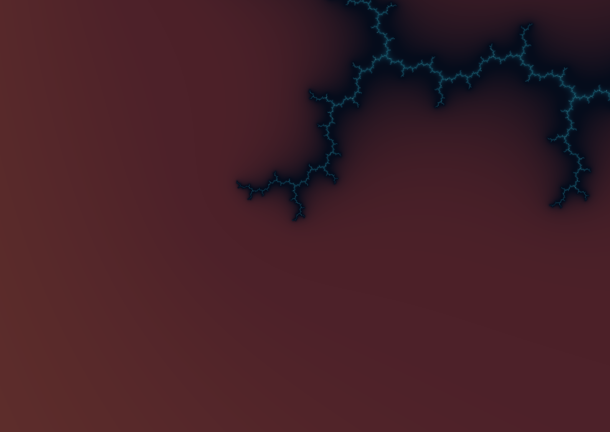

# Bend 2 Mandelbrot

A native Retina explorer built with Bend 2.0.16 and dedicated Metal compute kernels, with a restrained teal, ivory and copper palette. All substantial fractal computation runs on Apple Silicon Metal: ordinary escape iterations, scalable-precision reference orbits, perturbation, numerical repair, coloring and pixel packing. Bend GPU code renders ordinary depths; a flat-buffer Metal kernel renders multiprecision pixels. The current local build is an ARM64 AppKit application; this experiment is macOS-specific.

**Bend 2** means the second generation of the Bend language. The **v0.1.0** tag preserves the working viewer before further deep-zoom algorithm experiments.



On an Apple Silicon Mac with [Bend 2](https://github.com/bendlang/bend) installed (tested with **2.0.16**), Apple clang/Xcode Metal tools, and Python 3:

```sh
git clone https://github.com/tomc98/bend-2-mandelbrot.git
cd bend-2-mandelbrot
./build.sh
./run.sh
```

Requires the existing Bend installation, Apple clang/Xcode Metal tools and macOS Python 3. Nothing is downloaded or installed by these scripts. Rebuild after source edits; `run.sh` only builds when the executable is missing. The GPU is required by default and a failed GPU dispatch is an error, not a silent CPU fallback. `./run.sh --cpu` is an explicit ordinary-precision comparison mode; multiprecision rendering requires Metal.

## Explore

- Click or hold the left mouse button: zoom in toward the pointer. Move the held pointer to steer.
- Click or hold the right mouse button: zoom out. Release stops the held zoom immediately.
- Shift-left-drag or middle-drag: pan. Scroll and pinch remain available.
- Held zoom accelerates smoothly; switching away from the window clears held input.
- Space: continuous zoom into the current center. G: start an antenna deep flight.
- 1: whole set; 2: Seahorse Valley; 3: double spiral; 4: 34-million-times seahorse.
- 5: antenna at span `1e-12`; 6: span `1e-100`; 7: span `1e-300`.
- C: shift the palette; [ / ]: change the iteration budget; H: hide the overlay.
- R: return to Seahorse Valley; Q or Escape: quit.

The depth landmarks are explicit jumps, not claims of uninterrupted travel from the overview. Automatic zoom continues from any current view without resetting or cycling. The antenna is centered on the exact Mandelbrot boundary point `c = i`, whose reference orbit is known exactly; this gives a reliable route through hundreds or thousands of decimal orders. The ordinary seahorse bookmark has a finite decimal coordinate and is not guaranteed to remain on interesting boundary detail indefinitely.

## Image quality and responsiveness

The default 1100 × 780-point window renders **2200 × 1560 actual backing pixels** on the verified 2× Retina display, including during input. Each pixel receives an actual fractal sample; there is no lower-resolution navigation mode. Smooth escape coloring avoids discrete iteration bands. At 2× backing scale the logical image naturally incorporates four independently computed backing pixels per logical pixel. The renderer currently uses one sample per backing pixel, so extremely thin boundaries can still alias; there is no claim of complete antialiasing.

Input and cached-image reprojection run independently of the render worker. The interactive scheduler has **up to three active GPU batches and one replaceable latest view**, with no FIFO of render requests or camera gestures. Each persistent worker has its own Bend heap, pipe and cancellation mailbox; at most one request is outstanding per worker. Batches are 256 × 256 pixels during mouse/scroll/automatic motion. A stationary multiprecision view can use 512 × 512 batches when the moving average of recent complete tile times, normalized to 256 × 256, is below 2 ms. The pool admits two batches for those larger tiles or budgets above 4,096 iterations, otherwise three. During motion, it admits two ordinary-precision batches or one multiprecision/high-budget batch. A lower limit drains existing submissions rather than forcibly interrupting GPU commands. Mouse and animation changes accumulate into a single affine camera transform; only a selected snapshot is sent to Python. When a worker finishes, remaining unsent regions of a superseded view are abandoned and that worker takes the latest camera. Camera snapshots themselves are serialized and coalesced. Revision tracking prevents out-of-order results from corrupting frame assembly or covering a newer complete frame. A new click or scroll prioritizes the region under the pointer; a rotating cursor then updates the rest of the viewport. Input/cache animation uses the screen refresh rate, capped at 120 Hz, and runs in common event modes so mouse tracking does not suspend it.

Completed, still-useful regions appear immediately over the transformed image cache. A stationary view finishes all its regions, combines them into one native-resolution image, then stops rendering. The HUD shows refinement progress and individual batch time while working, then elapsed whole-view time after completion (including camera preparation, worker output and image assembly). The temporary cache is limited to 256 region layers, with offscreen and fully covered layers removed. Each displayed fresh pixel is an actual fractal sample; cache scaling temporarily interpolates previous samples.

Preset, palette, iteration and size changes invalidate all active workers through their shared generation values. Navigation independently invalidates each batch when its region leaves the viewport or its relative scale leaves the 0.8–1.25 range. The worker checks this value before Bend work, between reference-orbit chunks, before repair/packing, and between groups of at most 32 repair candidates. A submitted GPU command finishes; it cannot be preempted by this application. GPU candidate collection avoids submitting repair passes for pixels that do not need them. Each worker retains one completed reference orbit, keyed by precision, center and a reference capacity rounded up to 256 iterations. Small iteration-budget increases can reuse that capacity; the actual pixel iteration budget is unchanged. Parallel workers duplicate this small cache and runtime resources; concurrency is intentionally capped.

This bounds obsolete queued work, not the mathematical cost of an individual pixel or submitted command. Difficult multiprecision pixels can still take time. There is no claim of 60 newly computed full-resolution frames per second. Frame dimensions stop at 4096 pixels per axis. The legacy full-frame protocol remains available for offline output and comparisons.

Actual 3840 × 2160 output: [seahorse](evidence/seahorse-4k.png), [100-order antenna](evidence/antenna-1e100-4k.png).

## Precision and GPU ownership

`core.bend` and `complex.bend` use approximately 48-bit double-single arithmetic at ordinary depths. Below a pixel step of `2^-35`, `camera.py` requests progressively more precision: enough fixed-point fractional bits for the pixel step, plus 80 guard bits, rounded to 16-bit limbs. Rational camera bookkeeping preserves tiny pans without adding them to an ordinary floating-point absolute coordinate. The host coalesces relative gesture transforms; the rational state is compacted at snapshot boundaries to 128 bits below a pixel step (at least 192 fractional bits), so integer sizes stay bounded during long flights. The coalescing stress check differed from sequential exact camera operations by less than `6e-12` pixels; individual `Camera.zoom` and inverse-pan operations retain their exact algebraic tests.

`precision.metal` computes the reference orbit using variable-length radix-65536 integer limbs on Metal. Its `deep_pixels` kernel evaluates independent pixels directly into a contiguous GPU buffer. Below the moderate-depth float cutoff, separate mantissas and exponents keep a displacement of `1e-1000` from underflowing to zero. Fusing linear and quadratic terms removes redundant normalization; every orbit iteration, escape check, rebase and glitch check remains. Detected numerical cancellation requests direct multiprecision GPU repair. Reference work is dispatched in bounded chunks. The exact `i` orbit has a GPU shortcut; nearby views reuse that exact anchor while keeping their actual pixel displacement. General centers use cooperative multiprecision multiplication: 32 GPU lanes through 256 fractional bits and 128 lanes above that, with exact integer convolution columns followed by the original carry/rounding rule. Orbit steps remain sequential because each depends on the previous step.

Through 5,440 fractional bits, each generic reference step computes its three independent products together. Symmetric convolution terms share their input loads, then three GPU lanes independently carry and round the real square, imaginary square and cross product directly into separate outputs. This removes four barriers per step and the intermediate limb-buffer round trip while preserving the fixed-point result. The three products fit the existing threadgroup scratch allocation; larger precisions use the previous multiplication path.

`worker.c` connects the Bend effect protocol and Metal buffers. Packing reads the flat buffer for deep views and traverses the Bend quadtree for ordinary views. The deep path avoids building an image tree and serializing the reference orbit into Bend objects. Every GPU frame verifies actual fractal dispatch through its selected engine and checks command-buffer errors. Logs include the actual Metal device, engine, reference cache hit/miss, reference lane count, reference/pixel/repair GPU timing, reference wall time, pixel wall time and total pre-packing wall time. A cache hit with `reference_GPU_ms=0` means no reference dispatch was needed; zero repairs means the glitch detector requested none. AppKit/CoreAnimation displays the result. CPU work consists of window/input/HUD orchestration, rational **camera** bookkeeping, serialization and Bend ownership cleanup. No CPU orbit/reference/repair/color renderer is used in the default application. Decimal orbit calculations occur only in independent offline validation scripts.

`scaled.bend` and `perturbation.bend` retain the Bend GPU implementation for comparison. Run `MANDELBROT_BEND_DEEP=1 ./run.sh` to select it explicitly. The default is the faster dedicated Metal deep kernel; neither mode renders deep fractal pixels on the CPU.

This is scalable but **finite** precision. The current worker resource budget is 16,384 fractional bits, with the UI stopping at a 16,000-bit zoom exponent (roughly 4,800 decimal orders). That budget can be raised in code but time and memory grow; it is not literal infinity. The iteration limit is 16,384. A dark pixel means “did not escape within this budget,” not proven membership. Fixed-point rounding, finite mantissas and glitch heuristics are not a rigorous interval certification of every pixel. Challenging generic deep centers may need more guard bits or better repair heuristics.

## Verification and measurements

### Faster uncached references

September 20, 2026, Apple M4 Pro, 48 GiB RAM, Metal, Bend 2.0.16. Seven alternating paired runs compare this branch with `v0.1.0`, using one worker, unchanged 16,384-iteration budgets and native pixel sampling. Timings include generating an uncached generic reference and returning the first 256 × 256 tile of a 2200 × 1560 view. Process and shader startup are excluded.

| Reference precision | v0.1.0 median / p95 | Fused products median / p95 | Median speedup |
|---|---:|---:|---:|
| 320 bits, span 1e-68 | 82.0 / 90.2 ms | 44.1 / 44.7 ms | 1.86× |
| 1,088 bits, span 1e-300 | 231.0 / 232.0 ms | 109.8 / 111.0 ms | 2.10× |
| 3,424 bits, span 1e-1000 | 829.0 / 832.6 ms | 370.9 / 376.5 ms | 2.24× |

These generic cases share center `-.743643887037151 + .131825904205330i`, which escapes after 3,087 iterations and becomes visually uniform at these depths. Two 320-bit bounded workloads exercise the full 16,384-iteration reference budget: the parabolic center `-.75 + 0i` improved from 444.1 to 241.4 ms, and a period-three interior from 440.9 to 235.3 ms. Independent Decimal workload samples agree at 150 and 200 decimal digits. The reference-only optimization leaves cached full-frame performance essentially unchanged: four 2200 × 1560 workloads ranged from 0.5% faster to 1.2% slower in median time. All paired tiles and whole-image hashes match. These measurements establish a faster response to reference cache misses; pixel iteration cost remains.

[Raw paired measurements](evidence/fused-reference/production.json) include GPU reference timing, coordinates, individual runs and hashes. [Exact-state validation](evidence/fused-reference/exact-state.json) compares every emitted orbit float and final fixed-point limbs/signs with the saved shader, then checks the final state against an independent Python-integer oracle. All 36 cases pass from 48 through 16,384 bits, including both sides of the fused-kernel boundary. [Serial/chunked reference checks](evidence/fused-reference/reference-validation.json), [six-depth pixel/Decimal checks](evidence/fused-reference/acceleration-validation.json), and [region, repair, cancellation and recovery checks](evidence/fused-reference/batches-validation.json) also pass. The Bend laws/proofs are unchanged and pass the build.

```sh
python3 benchmark_fused_reference.py /path/to/v0.1.0/worker
python3 validate_reference_state.py /path/to/v0.1.0/precision.metal
python3 evidence/fused-reference/workload_audit.py
```

### Saved v0.1.0 deep renderer

September 20, 2026, Apple M4 Pro, 48 GiB RAM, Metal, Bend 2.0.16. Paired warm runs use the same **2200 × 1560 actual pixels, one worker, 256-pixel tiles, coordinates, iterations and palette**. Three runs per implementation are interleaved; compilation and warm-up are excluded. Time includes rendering, repairs, packing, IPC and stitching the whole image. Every compared full image is byte-identical.

| Workload | Iterations | Previous renderer | Dedicated Metal | Speedup |
|---|---:|---:|---:|---:|
| 320-bit antenna, span 1e-68 | 16,384 | 284.8 ms | 65.9 ms | 4.32× |
| Generic deep seahorse, span 1e-7 | 2,785 | 709.1 ms | 127.9 ms | 5.54× |
| 1088-bit antenna, span 1e-300 | 16,384 | 613.7 ms | 151.9 ms | 4.04× |

On the optimized renderer, separately tuning the 320-bit stationary workload to two workers and 512-pixel tiles measured **34.1 and 34.5 ms**, with roughly 5 ms p95 batch latency. Three workers gave slightly more throughput but longer individual batches. Expensive views retain smaller batches through the measured-time policy. These are workload-specific measurements on a shared machine, not a comparison against every other viewer or a guarantee of this speed at arbitrary coordinates. The antenna uses its exact `i` reference; generic reference preparation can cost much more.

Evidence: [paired native frames](evidence/acceleration/native-paired.json), [tile/concurrency tuning](evidence/acceleration/tuning.json), [numerical validation](evidence/acceleration/validation.json). Six 512 × 384, 16,384-iteration antenna images spanning 20 to 1,000 decimal orders match the preserved renderer byte for byte; all eight Decimal samples per image match exactly. Existing generic-image, repair, cancellation, region-stitching and native-pan checks also pass. An experimental BLA iteration-skipping table was rejected after speed and numerical-regression checks; it is not enabled in the viewer. Its failed evidence is retained separately in [bla/validation.json](evidence/bla/validation.json).

Live UI verification of the rebuilt app completed preset 7 at 2200 × 1560, 1088 bits and 16,384 iterations in **176.1 ms whole-view time**. The image and new completion-time HUD were inspected. Actual view-handler tests separately cover click/hold/release, pan and adaptive batch selection.

Historical before/after comparisons require a preserved pre-change executable and its adjacent `.gpu` file. These local build artifacts are not included in Git. The normal validation commands in the next section run against a fresh build without them; the `v0.1.0` source tag supplies a reproducible baseline for future changes.

```sh
python3 benchmark_acceleration.py /path/to/baseline/worker
python3 benchmark_tuning.py
python3 validate_acceleration.py /path/to/baseline/worker
```

### Checks and earlier measurements

```sh
bend PROOF.bend
python3 validate_reference.py
python3 validate.py
python3 validate_navigation.py
python3 validate_batches.py
clang -O2 validate_scheduler.c -o /tmp/mandelbrot-scheduler-test
/tmp/mandelbrot-scheduler-test
python3 benchmark_batches.py
python3 benchmark_parallel.py
clang -O2 -fobjc-arc -fblocks validate_interaction.m -framework AppKit -framework QuartzCore -o /tmp/mandelbrot-interaction-test
/tmp/mandelbrot-interaction-test
python3 render.py --width 512 --height 512 --iterations 1024 --frames 6 --csv evidence/seahorse-512-gpu.csv
python3 render.py --width 512 --height 512 --iterations 1024 --frames 6 --backend cpu --csv evidence/seahorse-512-cpu.csv
python3 render_deep.py --width 2200 --height 1560 --depth 100 --frames 4 --csv evidence/native-deep-fork8.csv
python3 render.py --width 3840 --height 2160 --frames 4 --output evidence/seahorse-4k.png
python3 render_deep.py --width 3840 --height 2160 --depth 100 --frames 4 --output evidence/antenna-1e100-4k.png
```

The following historical measurements predate the dedicated Metal deep renderer: Bend 2.0.16, Apple M4 Pro, 48 GiB RAM, Metal GPU; existing Apple clang 17. Compilation is excluded. Native apps and other GPU work may contend on this shared machine. These benchmarks use a persistent worker, discard the first two of four or six frames, and retain raw CSVs. `render_ms` covers reference generation and pixel rendering; `total_ms` additionally includes GPU repair, packing and the IPC transfer. Cold startup is separately recorded in CSVs.

| Workload | Pixels | Iteration budget | Precision | Warm render median | Warm end-to-end median |
|---|---:|---:|---:|---:|---:|
| Seahorse, GPU | 512 × 512 | 1024 | 48-bit | 11.8 ms | 13.8 ms |
| Seahorse, CPU comparison | 512 × 512 | 1024 | 48-bit | 106.7 ms | 110.1 ms |
| Antenna, span 1e-100 | 2200 × 1560 | 4096 | 432-bit | 218.7 ms | 269.1 ms |
| Antenna, span 1e-100 | 3840 × 2160 | 4096 | 432-bit | 851.2 ms | 976.2 ms |
| Seahorse, GPU | 3840 × 2160 | 1024 | 48-bit | 3071.1 ms | 3124.6 ms |

GPU/CPU ordinary frames agree on 262,143 of 262,144 pixels; the remaining pixel differs by one channel unit. Different floating-point lowering means byte-identical cross-backend output is not promised. Repeated frames within each measured backend are byte-identical. The very different 4K workloads show why these measurements are not a universal speedup claim.

The eleven checked laws cover exhausted iteration budgets, preserving escape at the final iteration, bounded-color behavior, requesting numerical repair, equivalence of each full-frame wrapper to its region wrapper at origin zero, and preserving the initial parameter offset from a zero scaled delta. That count includes three laws for the moderate-depth float perturbation loop. `PROOF.bend` passes; one explicit unsafe annotation is confined to the application's unbounded outside-world IO loop. These are properties of the Bend implementation. They do not prove equivalence of the dedicated Metal implementation or certify all floating-point numerical accuracy; independent image and Decimal checks provide finite numerical evidence for that implementation.

`validate_reference.py` compares 2,048 real GPU reference-orbit points at 128, 256 and 512 bits with an independent Decimal calculation; maximum float-conversion error was `5.67e-8`. `validate.py` checks exact camera zoom anchors/inverse pans, nonzero pixel coordinates and distinct GPU images at spans `1e-20`, `1e-50`, `1e-100`, `1e-300`, and `1e-1000` (up to 3,424 bits). Eight independently computed Decimal pixels at each depth match the GPU colors exactly. A 13-by-minus-9-pixel pan at depth 300 retains **187,125 identical overlapping pixels**. Full hashes, times and precision are in [validation.json](evidence/validation.json). This is real increasing-detail evidence, not stretched or recycled images.

A relevant Bend optimization: a helper returning either a shared reference root or tail made the iterator own that shared structure and perform atomic ownership work per iteration. Keeping the structurally bounded loop's reference arguments borrowed removed those application-level atomics without changing any image hashes. For native-size trees, eight fork levels were faster than seven; nine caused substantial scheduler overhead. More parallel leaves are not automatically faster.

Full native-size continuity also passed at **2200 × 1560, span 1e-300, 1088 bits and 16,384 iterations**: 3,392,037 overlapping pixels were identical after a nearby pan. A small pointer-anchored zoom produced a third distinct image; four Decimal comparison pixels matched exactly. See [native-navigation.json](evidence/native-navigation.json) and [native-300.png](evidence/native-300.png). Before the region scheduler, this high-budget case exposed an important limitation: the initial and panned frames took **10.9 and 10.3 seconds end-to-end**, while the nearby zoomed frame took **629 ms**. Exact boundary pixels and iteration budgets can dramatically change cost. The current automatic budget reaches 16,384 at large zooms; these slower results must not be confused with the 4,096-iteration table above.

### Latest-view scheduler verification

`validate_scheduler.c` drives the same scheduler used by the host through 100,000 changes while all three slots are occupied: no additional batch is admitted and only one latest view remains. It checks stale completions, out-of-order completion, exact region coverage, waiting for all current results before presenting a full frame, and shrinking the admission limit. `validate_interaction.m` exercises the actual AppKit view handlers offscreen with mocked pointer events and timed ticks: click, sustained hold, release, right zoom, focus loss, Shift-drag, workload-dependent worker limits and adaptive batch sizes. `validate_batches.py` compares 256- and 512-pixel regions with full-frame output at ordinary precision, a generic multiprecision center, a 50-order case requiring GPU repair, and 300 orders. All stitched images are byte-identical, including partial edge regions and the repaired pixel. It also checks 10,000 camera compactions, pre-dispatch cancellation, in-flight reference cancellation and recovery on the next request. The existing Decimal comparisons through 1e1000, exact camera-method tests, and deep-pan overlap checks pass.

Before the worker pool, on this Apple M4 Pro, one native 2200 × 1560, 16,384-iteration, 300-order run completed its 63 batches in **599.7 ms**: median batch **10.3 ms**, p95 **11.9 ms**, maximum **14.4 ms**. Its SHA-256 is identical to the previous full-frame result. The native seahorse run had a 3.7 ms median and 8.2 ms p95; its first batch included 454 ms of cold worker startup, while later batches were at most 10.3 ms. These are individual historical measurements, not universal latency limits or a controlled comparison against the older 10.9-second measurement. At that stage, 256-pixel regions had much shorter tails than 512-pixel regions, motivating the initial fixed tile size. The current policy can enlarge fast stationary deep batches after measuring the new renderer.

Evidence: [region/cancellation checks](evidence/scheduler/validation.json), [native batch timings](evidence/scheduler/native-batches.json), [GPU worker diagnostics](evidence/scheduler/worker.log). Reference invalidation was tested 50 ms after submission and returned a cancelled response at about 80 ms total; there was no stale image payload, and the next current request succeeded.

Live QA on the rebuilt app checked the 2200 × 1560 framebuffer, rapid landmark replacement, pointer zoom, drag, and a continuous flight from 300 to 303 decimal orders. Completed frames settle and the renderer becomes idle. Fresh detail during motion comes from independently completed regions over the transformed cache. This version implements latest-view scheduling; speculative future views are not submitted ahead of current work.

### XaoS interaction and bounded parallelism

The hold-left/hold-right controls follow [XaoS's interaction](https://xaos-project.github.io/); this does not incorporate its rendering engine. The live rebuilt viewer was checked for left-click zoom, right-click zoom-out, steering and settling after release. Timed hold and Shift-drag behavior also passed the actual offscreen view-handler tests. A later rapid-landmark UI check stopped when the UI tool detected the user actively exploring the window; further test input was not sent.

`benchmark_parallel.py` warms three persistent workers, then compares one, two and three admitted workers in alternating order (three measurements each), at 2200 × 1560. All concurrency levels produced identical hashes for ordinary seahorse, a generic multiprecision seahorse location, and the 300-order antenna. Bend 2.0.16 / Apple M4 Pro / Metal; compilation and initial warm-up are excluded. This is a shared GPU, and concurrent interactive use was detected during this work, so these timings describe the recorded run rather than isolated hardware limits.

| Workload | Iterations | One worker median | Two workers median | Three workers median |
|---|---:|---:|---:|---:|
| Seahorse | 1222 | 327.6 ms | 219.2 ms | 190.2 ms |
| Generic deep seahorse | 2785 | 1888.3 ms | 1608.9 ms | 1104.6 ms |
| Antenna, span 1e-300 | 16384 | 884.7 ms | 689.9 ms | 1100.2 ms |

More concurrency improved ordinary/generic frame throughput, but also increased individual batch latency. Three workers regressed on the expensive antenna workload in this run; the final policy therefore caps high-budget stationary work at two and multiprecision motion at one. The earlier quieter ordinary run measured approximately 223 ms with one worker and 141 ms with three. There is no universal speedup claim. Raw paired measurements are in [parallel.json](evidence/scheduler/parallel.json) and [parallel-run.log](evidence/scheduler/parallel-run.log).

### Deep reference and pixel work

The September 20 deep-rendering update preserves the bounded latest-view scheduler and native pixel density. For pixel-step exponents at least -60, a direct F32 perturbation loop avoids repeatedly normalizing mantissas and exponents. It still uses the multiprecision reference, the same recurrence, rebasing, escape budget and glitch repair. Smaller steps retain the scaled loop for extreme depths. The branch cutoff is conservative; this is not a claim of arbitrary precision from ordinary floats.

On the Apple M4 Pro / Bend 2.0.16 / Metal, interleaved warm **single-worker** 2200 × 1560 tests measured a generic seahorse frame at 2,785 iterations at **1,153 ms before versus 701 ms after** (three-run medians, about 39% shorter). All full-frame hashes were identical. The 300-order antenna at 16,384 iterations remained on the scaled path: 595 ms versus 607 ms in the same run, so no improvement is claimed there. Increasing each tile from 16,384 to 65,536 parallel leaves regressed both cases and was discarded. Evidence: [pixel timings](evidence/deep-performance/pixel-float.json), [discarded extra-lane experiment](evidence/deep-performance/pixel-parallel.json).

Cooperative integer multiplication improves new generic reference orbits independently of the pixel optimization. These are single command-buffer GPU measurements, excluding compilation, with byte-identical orbit outputs:

| Fractional bits | Orbit points | Serial GPU | Cooperative GPU | Lanes |
|---|---:|---:|---:|---:|
| 144 | 512 | 25.93 ms | 5.98 ms | 32 |
| 1088 | 512 | 480.79 ms | 35.24 ms | 128 |
| 3424 | 512 | 4516.54 ms | 123.86 ms | 128 |
| 16384 | 128 | 25362.66 ms | 272.85 ms | 128 |

Production cancellation chunks add dispatch overhead. A separate cold-reference request through the actual worker (one 256 × 256 tile, generic center, 512 iterations) measured **495 → 44 ms** at 1e-300 and **4603 → 163 ms** at 1e-1000, with identical pixels. Those tiles are bounded at this iteration budget; this measures reference-heavy work, not a richly detailed whole frame at 1,000 orders. A 144-bit request increasing its budget from 1,025 to 1,030 reused the rounded reference capacity and measured 39.5 → 7.3 ms. Cached references do not receive the reference-kernel speedup. Evidence: [reference GPU timings](evidence/deep-performance/reference-parallel.json), [production worker timings](evidence/deep-performance/reference-worker.json).

`validate_reference.py` checks serial/cooperative and chunked/unchunked orbits, including negative imaginary coordinates, zero, the exact i orbit, escaped centers, one-iteration chunks and 3,424-bit references. It caught and now covers escape exactly at a dispatch boundary. The kernel benchmark also compared through the 16,384-bit limit. `validate_fast.py` compares twelve 512 × 384 images across pixel-step exponents -35 to -61, including both sides of the fast-path cutoff: every pixel matches the preserved scaled implementation. Eight Decimal samples per image matched exactly for antenna views. Some chaotic generic seahorse samples have existing errors against Decimal in both implementations (up to 135 channel units in this set); matching the old image does not establish absolute numerical correctness. The existing antenna Decimal tests through 1e1000, pan-overlap, region stitching, repair, cancellation and recovery checks still pass.

Reproduction (pass a preserved pre-change worker executable with its adjacent `.gpu` file):

```sh
python3 benchmark_reference.py
python3 benchmark_reference_worker.py /path/to/baseline/worker
python3 benchmark_deep.py /path/to/baseline/worker
python3 validate_fast.py /path/to/baseline/worker
```

## License

[Apache License 2.0](LICENSE). Copyright 2026 Thomas Csere. See [NOTICE](NOTICE) for attribution.
